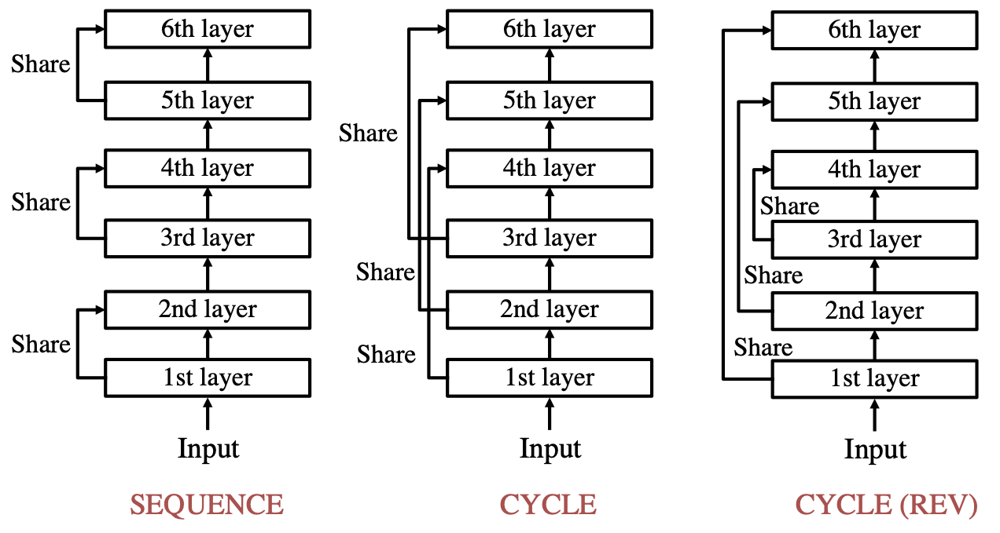
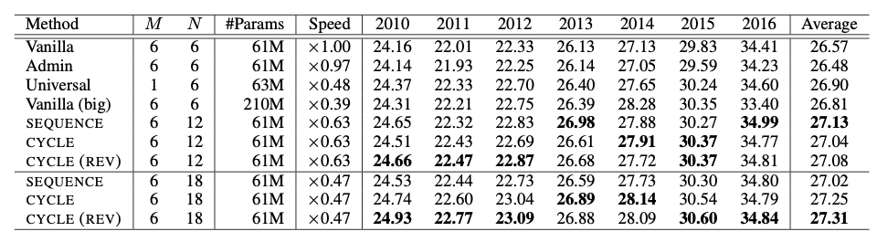

# Lessons on Parameter Sharing across Layers in Transformers

This repository contains transformers with sharing parameters across layers used in our paper.

>[Lessons on Parameter Sharing across Layers in Transformers](https://arxiv.org/abs/2104.06022)

>Sho Takase, Shun Kiyono







In addition, this document provides the way to train 12-layered Transformer with cycle (rev) in WMT En-De as an example.

## Requirements

- PyTorch version == 1.4.0
- Python version >= 3.6


## WMT En-De

### Training

##### 1. Download and pre-process datasets following the description in [this page](https://github.com/pytorch/fairseq/tree/master/examples/scaling_nmt)

##### 2. Train model

Run the following command on 1 GPU. This command makes the profiling file for Admin.


```bash
python -u train.py \
    pre-processed-data-dir \
    --arch transformer_wmt_en_de --optimizer adam --adam-betas '(0.9, 0.98)' \
    --clip-norm 0.0 --lr 0.002 --lr-scheduler inverse_sqrt --warmup-updates 8000 \
    --warmup-init-lr 1e-07 --dropout 0.3 --weight-decay 0.0 --criterion label_smoothed_cross_entropy \
    --label-smoothing 0.1 --max-tokens 3584 --min-lr 1e-09 --update-freq 32 --log-interval 100 \
    --max-update 50000 --decoder-layers 12 --encoder-layers 12 --share-all-embeddings \
    --init-type adaptive-profiling  --share-params-cross-layer --share-layer-num 2 --share-type cycle_reverse \
    --seed 1 --save-dir model-save-dir
```

Then, run the following command on 4 GPUs.

```bash
python -u train.py \
    pre-processed-data-dir \
    --arch transformer_wmt_en_de --optimizer adam --adam-betas '(0.9, 0.98)' \
    --clip-norm 0.0 --lr 0.002 --lr-scheduler inverse_sqrt --warmup-updates 8000 \
    --warmup-init-lr 1e-07 --dropout 0.3 --weight-decay 0.0 --criterion label_smoothed_cross_entropy \
    --label-smoothing 0.1 --max-tokens 3584 --min-lr 1e-09 --update-freq 32 --log-interval 100 \
    --max-update 50000 --decoder-layers 12 --encoder-layers 12 --share-all-embeddings \
    --init-type adaptive --share-params-cross-layer --share-layer-num 2 --share-type cycle_reverse \
    --keep-last-epochs 20 --seed 1 --save-dir model-save-dir
```

If training diverges, please set `--clip-norm` to 1.0.

`--share-type` specifies the type of the sharing strategies.
To use other strategies, check the following list:

* Sequence: `sequence`
* Cycle: `cycle`

If you assing the same number to `--share-layer-num`, `--encoder-layers`, and `--decoder-layers`, the model shares parameters of one layer across all layers such as Universal Transformers.

### Test (decoding)

Averaging latest 10 checkpoints.

```bash
python scripts/average_checkpoints.py --inputs model-save-dir --num-epoch-checkpoints 10 --output model-save-dir/averaged.pt
```

Decoding with the averaged checkpoint.

```bash
python generate.py pre-processed-data-dir --path model-save-dir/averaged.pt  --beam 4 --lenpen 0.6 --remove-bpe | grep '^H' | sed 's/^H\-//g' | sort -t ' ' -k1,1 -n | cut -f 3- > generated.result
```

* We used ```--lenpen 0.6``` for newstest2014, and ```--lenpen 1.0``` for otherwise.


### Compute SacreBLEU score

Detokenize the generated result.

```bash
cat generated.result | $mosesscripts/tokenizer/detokenizer.perl -l de > generated.result.detok
```

* mosesscripts is the PATH to mosesdecoder/scripts

Compute SacreBLEU.

```bash
cat generated.result.detok | sacrebleu -t wmt14/full -l en-de
```

## Acknowledgements

A large portion of this repo is borrowed from [Transformer-Clinic](https://github.com/LiyuanLucasLiu/Transformer-Clinic).
